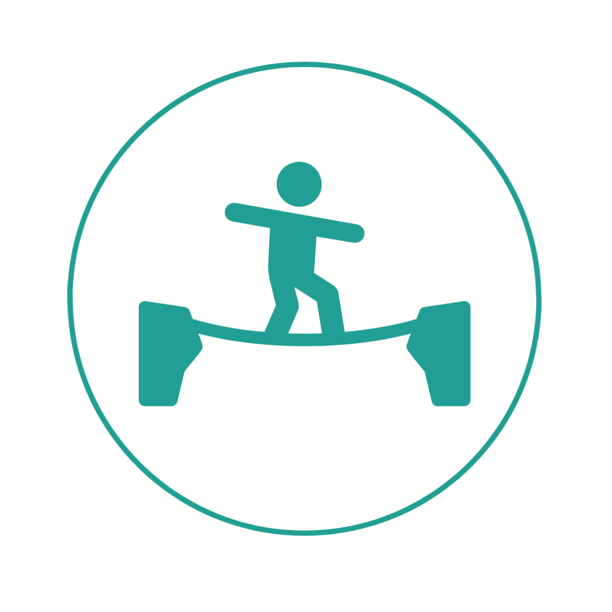

  

# Slacker - Connecting Slackliners One Line at a Time
📝 **Authors**:
- Dianna Borinaga (DiannaBanana)
- Brendan Micetich (brendanmicetich)
- Karl Bonnici (kbonnici)
- Yiming Huang (RanHuii)
- Sam Kosman (skosman)

## 🗺 Overview
We propose to create a mobile application where users can quickly and easily see where fellow slackliners are setting up their slacklines, and have the option to announce where they are via placing a pin on our map.

Checkout out our product page [here](https://sites.google.com/view/csc485a-slacker/home)
  
You can also find our Demo video [here](https://www.youtube.com/watch?v=SG7ucTStNiw)

### ✔ Decisions Made
* Real-time view of slackliners on the map
* Toggle to see real-time view vs. popular spots in general
* Strong mobile presence, cross platform to maximize accessibility
* Dockerized application for easy deployment and collaboration
* Minimalistic design for ease of use and minimal cluttering of information

Please note that we are **not** tracking users' GPS location, instead, the user places a pin down at their desired location, or manually asks the app to do so for them.

## 🌐 Architecture
* Hosting will be done on [GCP](https://cloud.google.com/)
* Database: [Google Firestore](https://cloud.google.com/firestore)
* UI framework: [React Native](https://reactnative.dev/)
* Map API: [React Native Maps](https://github.com/react-native-maps/react-native-maps)

## Milestone 1: Map Dashboard (⚠ Due Feb 18, 2022)
This milestone will entail only the most basic functionality of the app to be considered semi-usable. To that end, we will have implemented the following features:
- [x] Users can view the map
- [x] Users can see any pins that others have placed
- [x] Users can place down their own pin, specifying only the most essential and basic information (short description, length & type of slackline)

## Milestone 2: Hotspots (⚠ Due Mar 11, 2022)
By this point the team will have a more solid grasp of our tech stack and will be able to work more quickly, so more interesting features will be present.
- [x] Users can sign up and sign in using their preferred email and a password
- [x] Hotspots with at least 1 person `checked in` at them will have a 🔥 emoji displayed to indicate current activity.
- [x] When a user checks in to a hotspot, they can optionally specify the duration which they plan on remaining at that location. After some time, the 🔥 emoji will dissapear, and the hotspot will no longer be considered active.
- [x] Hotspot filter: Users can press a toggle to either view only active hotspots, or to view all spots in general. Color mappings will be used for all kinds of spots to communicate popularity (ex. a blue hotspot might only have < 3 people at it, whereas a red one might have > 5).
- [x] More pin details: Number of people checked in at the hotspot, view photographs users have taken of that spot, comments/reviews, and maybe more.

## Milestone 3: Favorites & Friends (⚠ Due Apr 1, 2022)
This milestone focuses on more of the *nice-to-have's* than the previous two, however the features implemented here will still be very useful and make using the app a much easier experience as the userbase and number of registered spots grows.

- [x] Add/delete your favorite spots in a list where you can click on any one of them to take you right to that location for viewing information.
- [x] Any spots that are on the map which are also a part of the user's `favorites` list will be highlighted.
- [ ] ~~Send a URL invite for a particular spot to anybody, and if the recipient doesn't have the app, they will be directed to the appropriate location to download it.~~

## Possible Future Extensions
- [ ] See a list of friends or followers and what spots they are currently checked in at.
- [ ] Points system to reward users for participating with the app. This could also be used as a pseudo skill classifier, rather than outright specifying the difficulty of the `hotspot`.
- [x] Public/Private pins: Drop a pin that only your frieds/followers can see, or make it open to everyone, or just yourself for future reference.
- [ ] Marketplace where users can purchase affiliated slackline merch (slacklines, clothing etc). This could be an avenue for sponsorships, advertisements and affiliations to make this profitable.
  
### Download the App
Currently, the app is available to download as an APK on Android, and available to use through the [TestFlight](https://developer.apple.com/testflight/) app on IOS. For either or these, send us a message in the CSC 485A slack and we will send you a link :)
